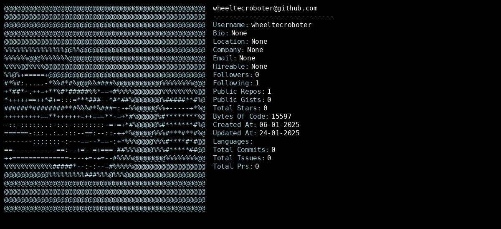

# GitHub Profile README Generator

This repository helps you create an automatically updating GitHub profile README with a neofetch-like ASCII art of your GitHub stats.

## 🚀 Setup

### 1. Repository Setup
1. Fork this repository
2. ⚠️ **Important**: Rename it to match your GitHub username exactly
   - Example: `username/username`

### 2. Create GitHub Token
1. Go to [GitHub Settings → Developer Settings → Personal Access Tokens → Tokens (classic)](https://github.com/settings/tokens)
2. Click "Generate new token (classic)"
3. Name: `ReadmeFetch Token` (or whatever you wanna name it)
4. Expiration: Choose as needed - I would recommend to let it never expire.
5. Select scopes:
   - ✅ `repo` (Full repository access) 
6. Click "Generate"
7. 📝 **COPY THE TOKEN** - You won't see it again!

### 3. Configure Repository
1. Go to your fork's "Settings" → "Secrets and variables" → "Actions"
2. Create new repository secret:
   - Name: `GH_TOKEN`
   - Value: Your copied token

### 4. Enable Actions
1. Go to "Actions" tab
2. Click "I understand my workflows, go ahead and enable them"
3. Enjoy! =)


## ⚙️ Configuration

Edit `config.json` to customize your profile:
Remove keys so they won't appear in your README :)!

```json
{
  "show_stats": true,          // Show GitHub statistics
  "show_languages": true,      // Display language usage
  "show_contributions": true,  // Show contribution graph
  "custom_note": "",          // Add personal message
  "ascii_art": "default"      // "default" or "minimal"
  //etc...
}


## Example Output
<div align='center'>
  
</div>
